<h1 align="center">pQT Protocol ($pQT3)</h1>

<p align="center">
  <b>Immutable Quantitative Tightening Tokenomics on Solana</b>
</p>

<p align="center">
  <a href="https://solana.com"></a>
  <a href="#-механика-протокола-и-архитектура"></a>
  <a href="https://www.anchor-lang.com"></a>
  <a href="LICENSE"></a>
</p>

---

## 📌 Обзор

**pQT Protocol** — первая криптовалюта, переносящая логику количественного ужесточения
центральных банков (Quantitative Tightening, QT) в полностью неизменяемую токеномику
на блокчейне Solana, построенную на стандарте **Token-2022**.

Протокол использует встроенное расширение **Transfer Fee Extension** (0.05%) и
передаёт право на изъятие удержанных комиссий (`withdraw withheld authority`)
программному Derived Address (**PDA**), полностью управляемому смарт-контрактом.

Команда проекта не имеет отдельного ключа для сбора или вывода накопленных
комиссий: как только withdraw-withheld authority передан PDA, эта операция
доступна только через саму программу и может быть инициирована кем угодно.

---

## ⚡ Механика протокола и архитектура

### 1. Начисление комиссии (0.05%)
При любом переводе $pQT3 программа Token-2022 автоматически удерживает **5 базисных
пунктов (0.05%)** от суммы перевода прямо на токен-аккаунте получателя, в виде
удерживаемого баланса (`withheld_amount`).

### 2. Децентрализованный сбор (PDA Fee Authority)
Право `withdraw_withheld_authority` закреплено за PDA смарт-контракта:

```
seeds = [b"vault-authority"]
```

PDA не имеет приватного ключа — программа подписывает CPI от его имени через
`invoke_signed`/`with_signer`, поэтому вывод комиссий невозможен в обход контракта.

### 3. Публичная инструкция `harvest_and_distribute`
Любой пользователь или бот вызывает публичную инструкцию `harvest_and_distribute`.
В рамках **одной атомарной транзакции** происходит:

1. **Harvest:** контракт собирает удержанные комиссии со всех переданных
   токен-аккаунтов на сам Mint (`harvest_withheld_tokens_to_mint`).
2. **Withdraw:** контракт выводит эти комиссии с Mint на собственный Vault
   (`withdraw_withheld_tokens_from_mint`), подписываясь PDA.
3. **🔥 Burn (70%):** CPI-сжигание 70% собранной суммы — уменьшение circulating supply.
4. **⚡ Public Bounty (20%):** мгновенный перевод 20% на счёт вызывающего — стимул
   для ботов и любых участников сети запускать сбор.
5. **🛡️ Dev Treasury (10%):** перевод оставшихся 10% в резерв разработчика.

---

## 🔄 Схема работы (Sequence Diagram)

```mermaid
sequenceDiagram
    autonumber
    actor Caller as Любой пользователь / бот
    participant Contract as pQT Program (Anchor, PDA vault-authority)
    participant Token2022 as Solana Token-2022 Program
    participant Accounts as Токен-аккаунты пользователей
    participant Vault as Vault (ATA PDA)
    participant Treasury as Dev Treasury Account

    Note over Accounts, Token2022: Удержание 0.05% при каждом переводе
    Caller->>Contract: Вызов harvest_and_distribute()

    rect rgb(25, 25, 35)
        Note over Contract, Token2022: Harvest → Withdraw (подпись PDA vault-authority)
        Contract->>Token2022: harvest_withheld_tokens_to_mint(accounts)
        Token2022->>Contract: Комиссии собраны на Mint
        Contract->>Token2022: withdraw_withheld_tokens_from_mint()
        Token2022->>Vault: Перевод комиссий на Vault
    end

    rect rgb(35, 25, 25)
        Note over Contract, Token2022: 🔥 CPI Burn (70%)
        Contract->>Token2022: burn(70% из Vault)
        Token2022-->>Vault: Токены уничтожены
    end

    rect rgb(25, 35, 25)
        Note over Contract, Caller: ⚡ CPI Transfer (20%)
        Contract->>Token2022: transfer_checked(20% из Vault → Caller)
        Token2022-->>Caller: Мгновенная выплата Bounty
    end

    rect rgb(25, 25, 45)
        Note over Contract, Treasury: 🛡️ CPI Transfer (10%)
        Contract->>Token2022: transfer_checked(10% из Vault → Treasury)
        Token2022-->>Treasury: Пополнение Dev-резерва
    end
```



---

## Токеномика

| Параметр | Значение |
|---|---|
| Стандарт | Solana Token-2022 |
| Transfer Fee | 0.05% (5 bps) |
| Распределение комиссии | 70% Burn / 20% Bounty / 10% Dev Treasury |
| Withdraw Withheld Authority | PDA (`seeds = [b"vault-authority"]`) |
| Freeze Authority | Отозвана |
| Mint Authority | Будет отозвана после финализации параметров |
| Fee Config Authority | Будет отозвана после финализации ставки комиссии |

> До момента реального отзыва Mint и Fee Config authorities публичные материалы
> не должны утверждать, что они уже отозваны — проверяйте актуальное состояние
> командой `spl-token display <MINT>` перед публикацией любых финальных текстов.

## Repository Structure
- `/programs/pqt_protocol` — контракт на Anchor (Rust), инструкция `harvest_and_distribute`
- `/scripts` — Node.js-скрипты для деплоя, настройки authority и вызова harvest
- `metadata.json` — off-chain метаданные, зеркалирующие on-chain Token-2022 Metadata

## Links & References
- Metadata: https://raw.githubusercontent.com/babai-men/pqt/main/metadata.json
- Logo: https://raw.githubusercontent.com/babai-men/pqt/main/pqt-logo.png
- Website: https://babai-men.github.io/pqt
