<h1 align="center">pQT Protocol ($pQT)</h1>

<p align="center">
  <b>Immutable Quantitative Tightening Tokenomics on Solana</b>
</p>

<p align="center">
  <a href="https://solana.com"></a>
  <a href="#-protocol-mechanics-and-architecture"></a>
  <a href="https://www.anchor-lang.com"></a>
  <a href="LICENSE"></a>
</p>

---

## 📌 Overview

**pQT Protocol** is the first cryptocurrency that brings Central Bank Quantitative
Tightening (QT) logic into fully immutable tokenomics on Solana, built on the
**Token-2022** standard.

The protocol uses the built-in **Transfer Fee extension** (0.05%) and hands the
right to withdraw withheld fees (`withdraw_withheld_authority`) to a
**Program Derived Address (PDA)** controlled entirely by a smart contract.

The team holds no separate key for collecting or withdrawing accumulated fees:
once the withdraw-withheld authority is assigned to the PDA, that operation is
only possible through the program itself, and anyone can trigger it.

---

## ⚡ Protocol Mechanics and Architecture

### 1. Fee accrual (0.05%)
On every $pQT transfer, the Token-2022 program automatically withholds
**5 basis points (0.05%)** of the transferred amount on the recipient's token
account, as a withheld balance (`withheld_amount`).

### 2. Decentralized collection (PDA fee authority)
The `withdraw_withheld_authority` is assigned to the program's PDA:

```
seeds = [b"vault-authority"]
```

The PDA has no private key. The program signs CPIs on its behalf via
`invoke_signed` / `with_signer`, so fees cannot be withdrawn without going
through the contract.

### 3. Public instruction `harvest_and_distribute`
Any user or bot can call the public `harvest_and_distribute` instruction.
Within **a single atomic transaction**:

1. **Harvest:** the contract collects withheld fees from all supplied token
   accounts into the Mint (`harvest_withheld_tokens_to_mint`).
2. **Withdraw:** the contract withdraws those fees from the Mint into its own
   Vault (`withdraw_withheld_tokens_from_mint`), signing with the PDA.
3. **🔥 Burn (80%):** CPI burn of 80% of the collected amount, reducing
   circulating supply.
4. **⚡ Public Bounty (15%):** instant transfer of 15% to the caller, an
   incentive for bots and anyone else to run the harvest.
5. **🛡️ Dev Treasury (5%):** the remaining 5% is sent to the developer reserve.

---

## 🔄 Sequence Diagram

```mermaid
sequenceDiagram
    autonumber
    actor Caller as Any user / bot
    participant Contract as pQT Program (Anchor, PDA vault-authority)
    participant Token2022 as Solana Token-2022 Program
    participant Accounts as User token accounts
    participant Vault as Vault (PDA's ATA)
    participant Treasury as Dev Treasury account

    Note over Accounts, Token2022: 0.05% withheld on every transfer
    Caller->>Contract: Call harvest_and_distribute()

    rect rgb(25, 25, 35)
        Note over Contract, Token2022: Harvest → Withdraw (signed by PDA vault-authority)
        Contract->>Token2022: harvest_withheld_tokens_to_mint(accounts)
        Token2022->>Contract: Fees collected on the Mint
        Contract->>Token2022: withdraw_withheld_tokens_from_mint()
        Token2022->>Vault: Fees moved to the Vault
    end

    rect rgb(35, 25, 25)
        Note over Contract, Token2022: 🔥 CPI Burn (80%)
        Contract->>Token2022: burn(80% from Vault)
        Token2022-->>Vault: Tokens destroyed
    end

    rect rgb(25, 35, 25)
        Note over Contract, Caller: ⚡ CPI Transfer (15%)
        Contract->>Token2022: transfer_checked(15% from Vault → Caller)
        Token2022-->>Caller: Instant bounty payout
    end

    rect rgb(25, 25, 45)
        Note over Contract, Treasury: 🛡️ CPI Transfer (5%)
        Contract->>Token2022: transfer_checked(5% from Vault → Treasury)
        Token2022-->>Treasury: Dev reserve topped up
    end
```



---

## Tokenomics

| Parameter | Value |
|---|---|
| Standard | Solana Token-2022 |
| Transfer Fee | 0.05% (5 bps) |
| Fee distribution | 80% Burn / 15% Bounty / 5% Dev Treasury |
| Withdraw Withheld Authority | PDA (`seeds = [b"vault-authority"]`) |
| Freeze Authority | Revoked |
| Mint Authority | To be revoked once parameters are finalized |
| Fee Config Authority | To be revoked once the fee rate is finalized |

> Until the Mint and Fee Config authorities are actually revoked, public
> materials must not claim that they already are. Always verify the current
> on-chain state with `spl-token display <MINT>` before publishing final texts.

## Repository Structure

- `/programs/pqt_protocol`: Anchor smart contract (Rust), the `harvest_and_distribute` instruction
- `/scripts`: Node.js scripts for deployment, authority setup and calling harvest
- `metadata.json`: off-chain metadata mirroring the on-chain Token-2022 Metadata

## Links & References

- Metadata: https://raw.githubusercontent.com/babai-men/pqt/main/metadata.json
- Logo: https://raw.githubusercontent.com/babai-men/pqt/main/pqt-logo.png
- Website: https://babai-men.github.io/pqt
- X (Twitter): [@pQTprotocol](https://x.com/pQTprotocol)
